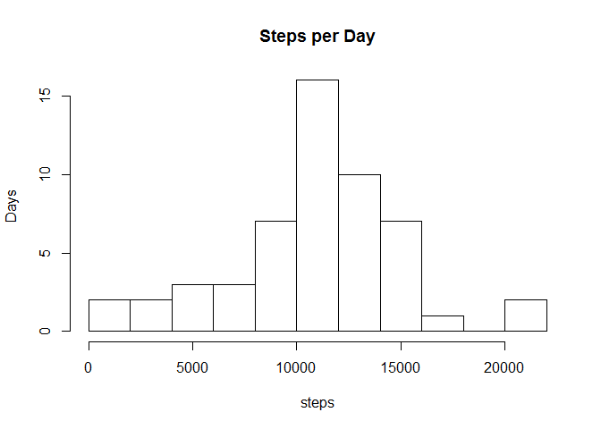
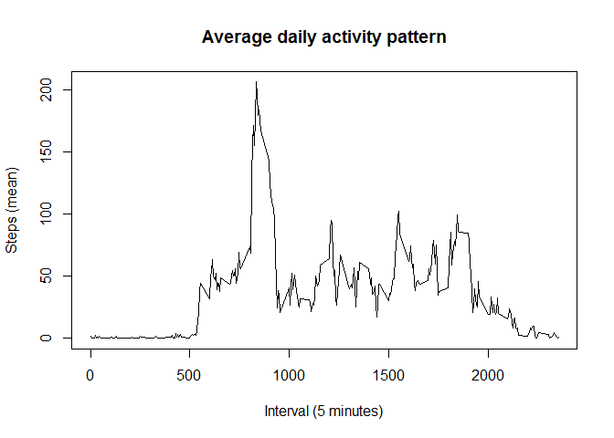
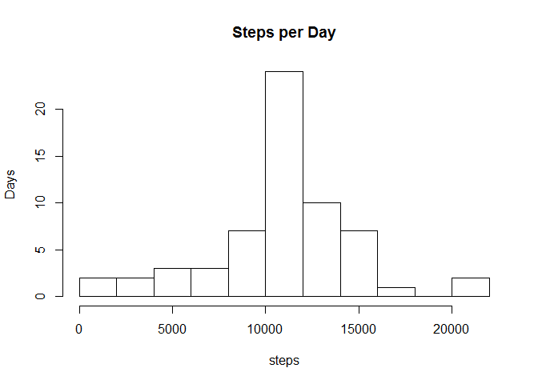
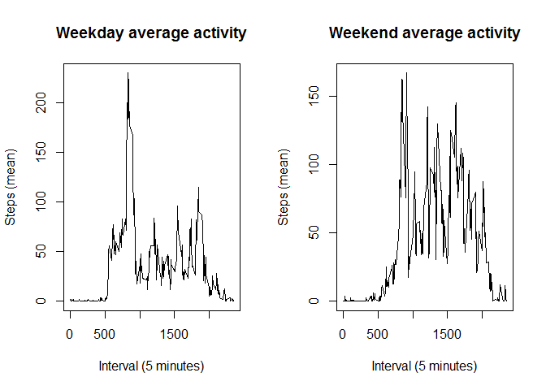

# Reproducible Research: Course Project 1

This is the finished assignment for the January 2016 Reproducible Research Course Project 1. It is a data analysis of of personal movement data from a personal activity monitoring device. 

The variables included in this dataset are:

* steps: Number of steps taking in a 5-minute interval (missing values are coded as NA)
* date: The date on which the measurement was taken in YYYY-MM-DD format
* interval: Identifier for the 5-minute interval in which measurement was taken

The dataset is stored in a comma-separated-value (CSV) file and there are a total of 17,568 observations in this dataset.


## Loading and preprocessing the data


```r
library(ggplot2)
```

```
## Warning: package 'ggplot2' was built under R version 3.1.3
```

```r
## lct <- Sys.getlocale("LC_TIME"); Sys.setlocale("LC_TIME", "C")
activity <- read.csv(unzip("activity.zip", files = "activity.csv"))
activity$date <- as.Date(as.character(activity$date), format = "%Y-%m-%d")
## Sys.setlocale("LC_TIME", lct)
```


## What is mean total number of steps taken per day?


```r
stepsperday <- aggregate(steps~date, data = activity, sum)
hist(stepsperday$steps, main = "Steps per Day", ylab = "Days", xlab="steps", breaks=8)
```

 

```r
dev.copy(png, './figures-html/totalsteps.png')
```

```
## png 
##   3
```

```r
dev.off()
```

```
## png 
##   2
```

```r
stepsperdaymean <- mean(stepsperday$steps, na.rm = TRUE)
stepsperdaymedian <- median(stepsperday$steps, na.rm = TRUE)
```

The mean total number of steps taken per day is 10766. The median is 10765.


## What is the average daily activity pattern?


```r
pattern <- aggregate(steps~interval, data = activity, mean)
plot(pattern$interval, pattern$steps, type="l", xlab="Interval (5 minutes)", ylab="Steps (mean)", main="Average daily activity pattern")
```

 

```r
dev.copy(png, './figures-html/averagedailyactivity.png')
```

```
## png 
##   3
```

```r
dev.off()
```

```
## png 
##   2
```

```r
moststeps <- which.max(pattern$steps)
moststepsinterval <- pattern[moststeps,]
```
Interval 835, on average across all the days in the dataset, contains the maximum number of steps (206).

## Imputing missing values


```r
totalna <- sum(is.na(activity$steps))
```
The activity data set contains 2,304 missing values.


```r
#replace NAs with average for each interval
activity2 <- activity
narows <- which(is.na(activity2$steps))
activity2[narows,]$steps <- pattern$steps[pattern$interval %in% activity2[narows,]$interval]
```

Activity2 is a new data set with all NA values filled in using the average number of steps taken in the corresponding interval. Below is a similar histogram as above calculated with the Activity2.


```r
stepsperday2 <- aggregate(steps~date, data = activity2, sum)
hist(stepsperday2$steps, main = "Steps per Day", ylab = "Days", xlab="steps", breaks=8)
```

 

```r
dev.copy(png, 'imputedstepsperday.png')
```

```
## png 
##   3
```

```r
dev.off()
```

```
## png 
##   2
```

```r
stepsperday2mean <- mean(stepsperday2$steps, na.rm = TRUE)
stepsperday2median <- median(stepsperday2$steps, na.rm = TRUE)
```
The mean and median number of steps per day using Activity2 (with imputed missing data) is almost exaclty the same as without the imputed data. The two histograms are fairly similar, and the conclusions ultimately drawn would probably be similar as well.

## Are there differences in activity patterns between weekdays and weekends?


```r
#add column of factor values determining if the given date is a weekend or weekday
days <- weekdays(activity2$date)
midweek <- c("Monday", "Tuesday", "Wednesday", "Thursday", "Friday")
weekend <- c("Saturday", "Sunday")
midorend <- factor((days %in% midweek),
      levels=c(FALSE, TRUE), labels=c('weekend', 'weekday'))
activity2 <- cbind(activity2, midorend)

#subset the data by weekday or weekend, calculate average steps per interval for each
activity_midweek <- subset(activity2, activity2$midorend == "weekday")
activity_weekend <- subset(activity2, activity2$midorend == "weekend")
pattern_midweek <- aggregate(steps~interval, data = activity_midweek, mean)
pattern_weekend <- aggregate(steps~interval, data = activity_weekend, mean)

#plot the data
par(mfrow=c(1,2))
plot(pattern_midweek$interval, pattern_midweek$steps, type="l", xlab="Interval (5 minutes)", ylab="Steps (mean)", main="Weekday average activity")
plot(pattern_weekend$interval, pattern_weekend$steps, type="l", xlab="Interval (5 minutes)", ylab="Steps (mean)", main="Weekend average activity")
```

 

```r
dev.copy(png, './figures-html/weekendvsweeday.png')
```

```
## png 
##   3
```

```r
dev.off()
```

```
## png 
##   2
```

The subject tends to be more active on the weekend than during the week.
